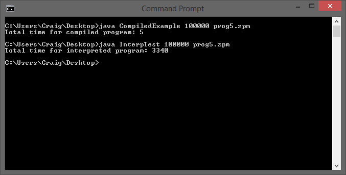

#What does and doesn't work
All of the included Z+- files work as inteded, with correct ouput. This leads me to believe that everything works in my program. Variable declaration and initialization work as intended, as do ```for``` loops.  

#Sample Output
###prog1.zpm
    a = 4
    b = 360
###prog2.zpm
    a = 1
    b = -4
###prog3.zpm
    A = 1032
    B = 31
###prog4.zpm
    A = 1049616
    B = -19943325
###prog5.zpm
    A = 1049616
    B = -19943325

#Interpreted vs. Compiled


The times in this photo show the time in milliseconds it took the run the compiled java program and the Z+- interpreter through 100000 iterations. As dictated in the photo, the compiled program takes a lot less time to run its course than the interpreted program. The interpreted program took about three seconds while the compiled program was done instantly. These findings are very typical of interpreted languages, as they are slower than compiled languages. The difference in time is likely extreme because I was the one coding the interpreter on top of java, and because of bad testing practices. To test the runtimes, I looped through each program 100000 times. For the compiled program this was easy, but for the interpreted I tried to ensure that the creatin of the filereader didn't take the majority of time. Before I made this change, the interpreted program would run for around 30 seconds. While the results are extreme, I still think it's a great example of one of the major cons of interpreted languages - the slow runtimes.
