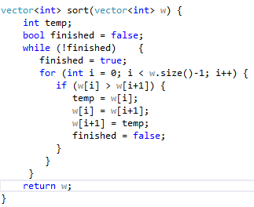
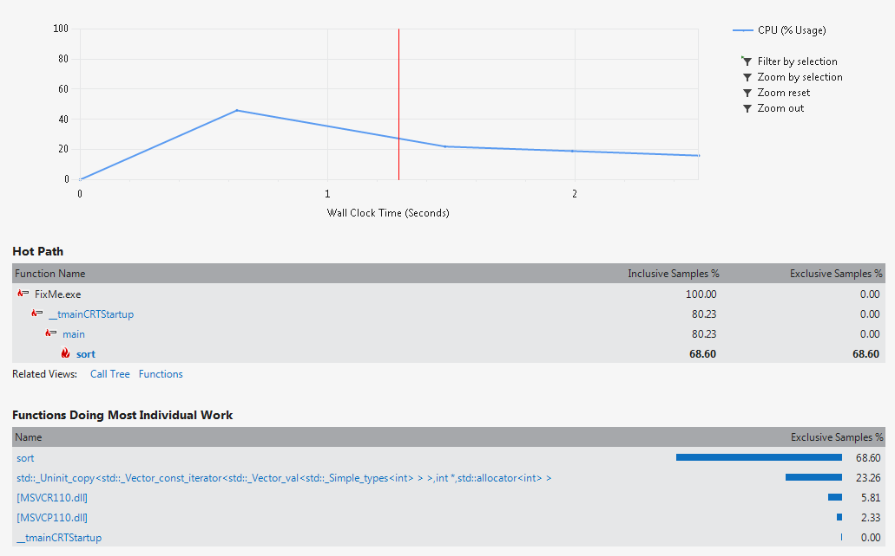
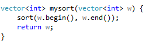
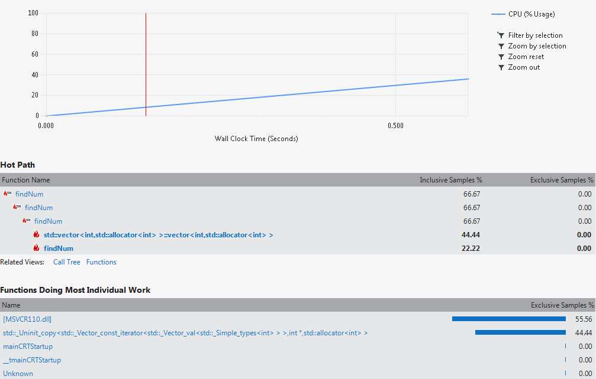
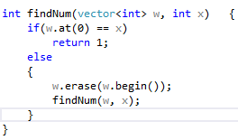
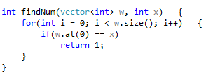
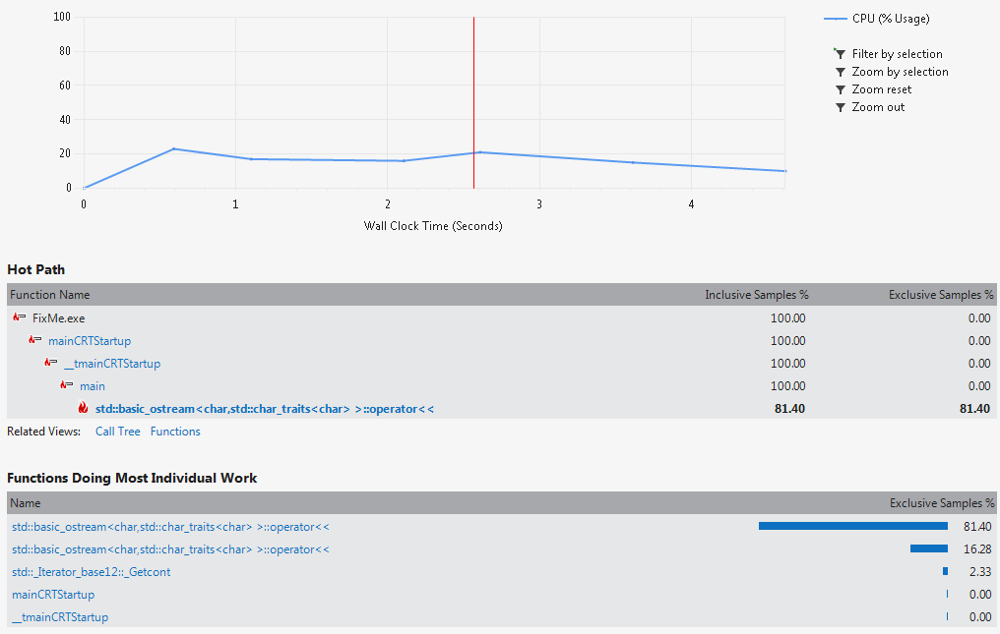

# Run 1
## Before Optimization
### Code

### Results


As you can see, the sort function takes a vast majority of the time. This is because the sort is done using bubble sort, which has a wore case running time of n^2. This sort function can be upgraded to a different algorithm to decrease the amount of time spent sorting.

## After Optimization
### Fixed Code

### Results


After changing the sort method to the stl's variation, the time spent sorting the numbers is mostly negligible.

# Run 2
## Before Optimization
### Code

### Results


As you can see above, a lot of the time is now spent in the ```findNum()``` function.
This is because, as the code above shows, the function is recursive. This means a new vector has be continually created as the function goes deeper and deeper. In the 'hot path' section we can see that a common path is for ```findNum``` to call itself. This can be greatly optimized by using a different searching algorithm.

## After Optimization
### Fixed Code

### Results


After changing the algorithm to a linear search the program spent almost no time in the find method. The only thing taking up time really at that point is the debug printing.
