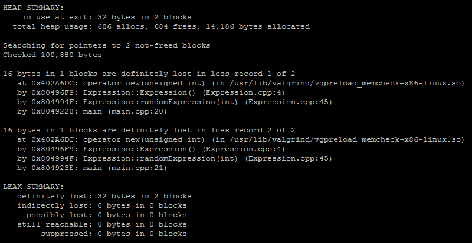
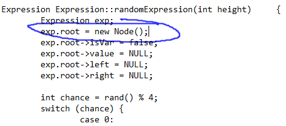
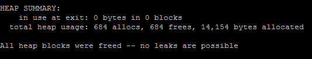

## Below is the output of my code before the fix


## Why Valgrind was useful
Firstly, I compiled and checked my code using the commands: 

    c++ -std=c++11 -w -g -o Expression main.cpp Expression.cpp
    /usr/bin/valgrind -v --leak-check=full ./Expression
    
This was extremely helpful because I the ```-g``` and ```--leak-check=full``` flags allowed me to see line numbers of where my errors started at. 
Below is the area of my code that was suspect according to valgrind.



I took the liberty of circling the troublesome line. The problem was that the line ```Expression exp;``` is calling the ctor in which I have the line ```root = new Node();```. I then proceed to reassign the root to a different new node as seen above. This caused a memory leak as the first node would be lost and never deallocated. Valgrind led me right to the area where my problem was.

## Below is the output of my code after the fix
