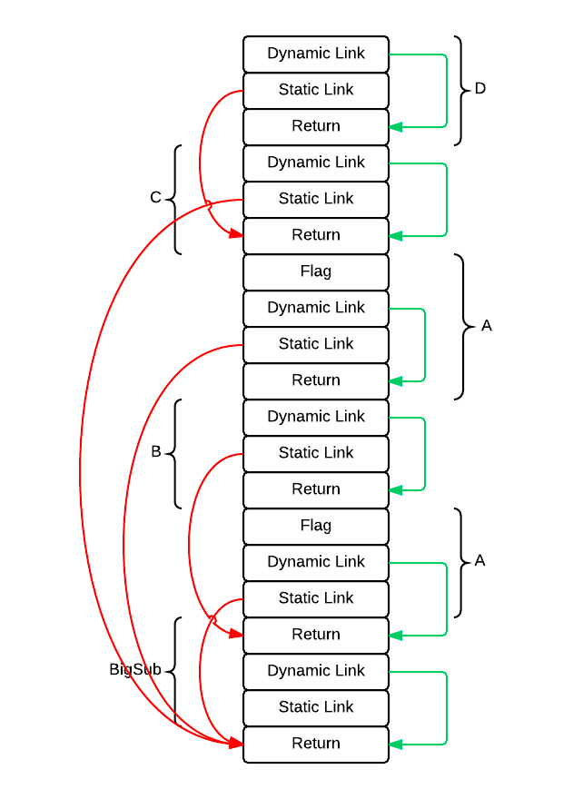

## Review Questions
### 10.
##### Static Chain
A chain of static links that connect certain activation record instances in the stack.

##### Static_Depth
An integer associated with a static scope that indicates how deeply it is nested in the outermost scope.

##### Nesting_Depth
The number of enclosing scopes between the caller and the subprogram that declared the subprogram.

##### Chain_Offset
The number of links to the correct activation record instance.

## Problem Set
### 3.

