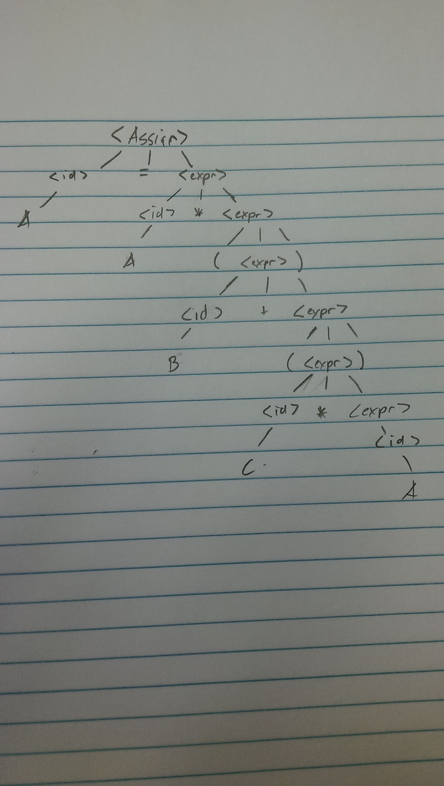
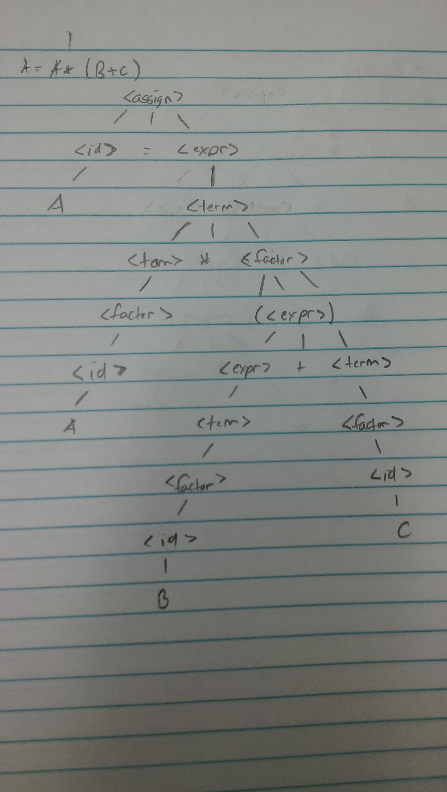
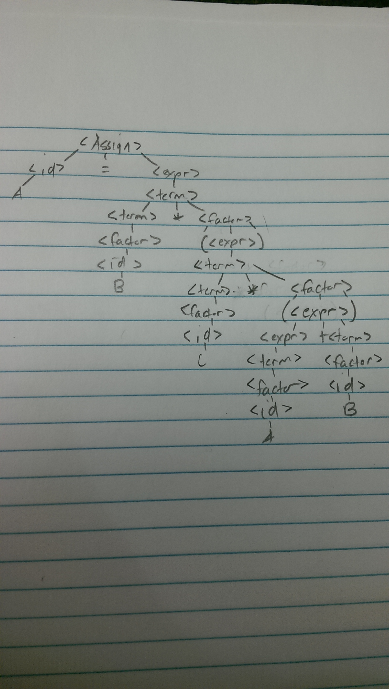

## Problem Set:

### 2a.
    <class_definition> ::= [public] [(abstract|final)] <name> [extends <name>] [implements <id>{, <id>}}]
    <id> ::= [A-Za-z0-9_]+

### 6a.
    <assign> -> <id> = <expr>
                  A  = <expr>
                  A  = <id> * <expr>
                  A  = A * <expr>
                  A  = A * (<expr>)
                  A  = A * (<id> + <expr>)
                  A  = A * (B + <expr>)
                  A  = A * (B + (<expr>))
                  A  = A * (B + (<id> * <expr))
                  A  = A * (B + (C * <expr>))
                  A  = A * (B + (C * <id>))
                  A  = A * (B + (C * A))

### 7c-d.
#### C.
    <assign> -> <id> = <expr>
                  A = <expr>
                  A = <term>
                  A = <term> * <factor>
                  A = <factor> * <factor>
                  A = <id> * <factor>
                  A = A * <factor>
                  A = A * (<expr>)
                  A = A * (<expr> + <term>)
                  A = A * (<term> + <term>)
                  A = A * (<id> + <term>)
                  A = A * (B + <term>)
                  A = A * (B + <factor>)
                  A = A * (B + <id>)
                  A = A * (B + C)

##### D.
d. A = B * (C * (A + B))

    <assign> -> <id> = <expr>
                  A = <expr>
                  A = <term>
                  A = <term> * <factor>
                  A = <factor> * <factor>
                  A = <id> * <factor>
                  A = A * <factor>
                  A = A * (<expr>)
                  A = A * (<term>)
                  A = A * (<term> * <factor>)
                  A = A * (<factor> * <factor>)
                  A = A * (<id> * <factor>)
                  A = A * (C * <factor>)
                  A = A * (C * (<expr>))
                  A = A * (C * (<expr> + <term>))
                  A = A * (C * (<term> + <term>))
                  A = A * (C * (<factor> + <term>))
                  A = A * (C * (<id> + <term>))
                  A = A * (C * (A + <term>))
                  A = A * (C * (A + <factor>))
                  A = A * (C * (A + <id>))
                  A = A * (C * (A + B))

### 11c-d.
C - NO

D - YES
